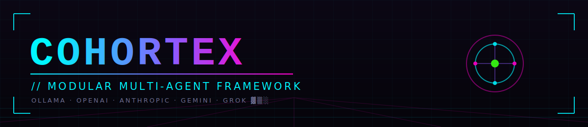
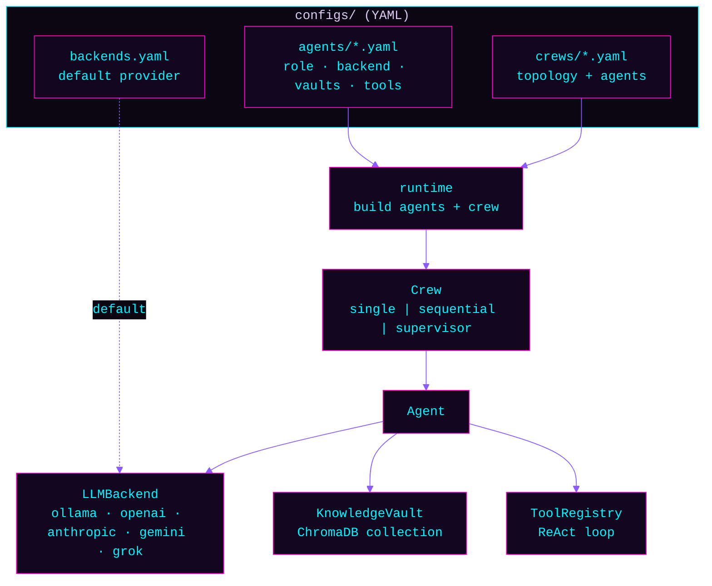

<p align="center">
  
</p>

<p align="center">
  
  
  
  
  
</p>

> `// modular · provider-agnostic · local-first`

A modular, provider-agnostic **multi-agent framework** with pluggable knowledge vaults.
Define agents in YAML — each with a role, an LLM backend (local Ollama or a cloud API),
and the knowledge vault(s) it should draw on — then run them **single**, **sequential**, or
under a **supervisor**. Local-first by default; nothing but `httpx` is needed to run on Ollama.

```python
from cohortex.runtime import run_crew
print(run_crew("research_team", "Why vector databases matter for AI").output)
```

## Why
Most agent demos hard-wire one provider and one prompt. Cohortex makes the moving parts
**configuration**: swap `gpt-4o-mini` for a local `phi3:mini` by editing one line; point an
agent at a different knowledge base by changing a vault name; turn three agents into a
supervised crew with a two-line YAML file. No code changes.

## Architecture



- **`LLMBackend`** — one `chat(messages) -> str` protocol; each provider is a small adapter.
  Selected per-agent, with a global default. Cloud SDKs load lazily, so local-only installs
  stay tiny. Every bundled backend also implements `chat_stream(messages) -> Iterator[str]`
  for token-by-token output — optional and duck-typed, so a fake/test backend never needs it.
- **`KnowledgeVault`** — a named ChromaDB collection with an embedder; `.search()` returns
  top-k context. Can point at an existing store (e.g. reuse another project's vault).
- **`DocumentSource`** — the opposite of a vault: loads whole files verbatim into the
  context window, no embeddings or chunking. Trades token cost for guaranteed recall — see
  [Long context vs. RAG](#long-context-vs-rag) below.
- **`AgentProfile`** — the YAML that defines an agent: `role, goal, backend?, model?,
  temperature?, max_tokens?, system_prompt?, api_key?, base_url?, vaults, context_docs,
  num_ctx?, tools`. `api_key` and `base_url` override the default environment variable /
  endpoint for that single agent — useful for BYOK (bring-your-own-key) scenarios in
  Cohortex Studio.
- **`Agent`** — retrieves vault context, builds a role prompt, calls the backend; if it has
  tools, runs a ReAct loop. `run()` returns a complete `AgentResult`; `run_stream()` yields
  `{"type": "delta", "text": ...}` chunks as they arrive, then `{"type": "done", "result": ...}` —
  falls back to a single delta for backends without `chat_stream` or for tool-using agents
  (a ReAct loop needs each complete JSON response to decide its next step, so there's nothing
  useful to stream mid-call there).
- **`Crew`** — orchestrates agents: `single`, `sequential` (pipe outputs), or `supervisor`
  (a router delegates subtasks to specialists, then answers).

## Quick start

```bash
git clone <repo> cohortex && cd cohortex
pip install -e .            # core deps (chromadb, httpx, pyyaml, python-dotenv)
ollama pull phi3:mini       # local model for the examples (no API key)

python examples/single_agent.py
python examples/sequential_crew.py
python examples/supervisor_crew.py
python examples/long_context_agent.py
python examples/rag_vs_long_context.py
python examples/streaming_agent.py
python run_all_examples.py  # runs every example, reports pass/fail
```

CLI:

```bash
python -m cohortex backends                     # list available backends
python -m cohortex crews                         # list configured crews
python -m cohortex run research_team "Explain RAG in two sentences"
```

## Configure, don't code

**Pick a backend globally** (`configs/backends.yaml`) or per-agent:

```yaml
# configs/agents/researcher.yaml
role: Research Analyst
goal: list the key facts about the topic
backend: anthropic          # ← override the global default just for this agent
model: claude-sonnet-4-5
vaults: [obsidian_vault]     # ← ground it in a specific knowledge base (RAG)
tools: [calculator]
```

Or skip retrieval entirely and load whole documents into context (long-context mode):

```yaml
# configs/agents/ops_analyst.yaml
role: Ops Analyst
goal: answer using the full document provided
context_docs: [./docs/it_ops_manual]  # ← directory of files, loaded verbatim, no chunking
num_ctx: 8192                          # ← Ollama context window (ignored by cloud backends)
```

**Define a crew** (`configs/crews/research_team.yaml`):

```yaml
topology: sequential          # single | sequential | supervisor
agents: [researcher, writer, editor]
```

Backends: `ollama` (local, no key), `openai`, `anthropic`, `gemini`, `grok` (xAI). Keys come
from the environment — run `python setup_env.py` (hidden input, writes a gitignored `.env`).

## Extending
- **Add a backend:** one file in `cohortex/providers/` with a class + `@register("name")`.
- **Add a tool:** decorate a function with `@tool` in `cohortex/tools/`; list it in a profile.
- **Add a vault:** a stanza in `configs/vaults.yaml` (`collection`, optional `db_path`).

## Security
No secrets in code or config. Keys are read from the environment via `python-dotenv`;
`setup_env.py` collects them with `getpass` (never echoed), verifies `.env` is gitignored
before writing, and sets `0600` perms. Ollama needs no key at all.

## Token accounting
Every backend captures per-call token usage (`prompt_tokens`, `completion_tokens`,
`total_tokens`) from the provider API response. `Agent.run()` includes it in
`AgentResult.meta["usage"]`, making it available to callers, the CLI, and Cohortex Studio's
live run view. Sequential crews support `max_handoff_chars` to truncate inter-agent context
and bound token growth. The Anthropic backend uses `cache_control: ephemeral` on the system
prompt so supervisor loops avoid re-tokenizing the same instructions each round.

## Long context vs. RAG
`KnowledgeVault` is retrieval-augmented generation: chunk a corpus, embed each chunk, and
feed the model only the top-k most similar pieces — cheap per call, but a fact can be missed
if its chunk doesn't embed close to the query. `DocumentSource` (`context_docs` on a
profile) is the opposite: no embeddings, no chunking, the entire file goes into the context
window every call — costlier per call, but recall is bounded only by the model's ability to
read, not by a similarity search. Set `num_ctx` on a profile to raise Ollama's context window
past its 2048-token default (cloud backends size their own window per model, no config
needed). `examples/long_context_agent.py` runs a classic "needle in a haystack" recall test
against a generated document; `examples/rag_vs_long_context.py` answers the same question
both ways and prints the token cost of each so the tradeoff is visible, not asserted.

## Testing
```bash
python tests/test_framework.py     # fake-backend unit tests, no network (or: pytest)
python run_all_examples.py         # local integration on Ollama
```

## License
MIT © Ryan Seibert. Built on patterns proven across my agentic-AI work (local RAG,
ReAct agents, and CrewAI-style pipelines).
