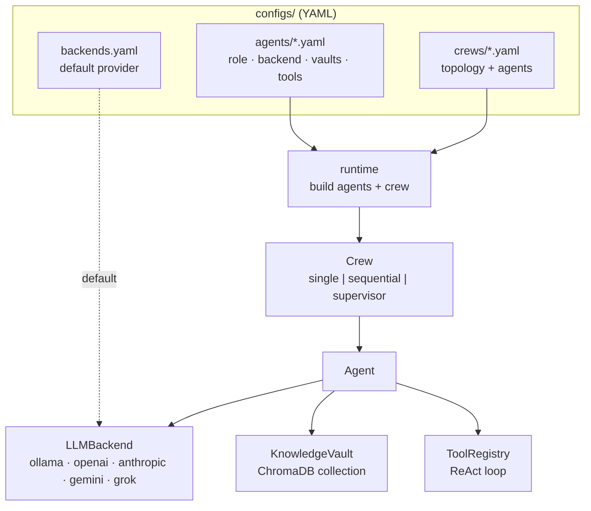

# VaultMind

A modular, provider-agnostic **multi-agent framework** with pluggable knowledge vaults.
Define agents in YAML — each with a role, an LLM backend (local Ollama or a cloud API),
and the knowledge vault(s) it should draw on — then run them **single**, **sequential**, or
under a **supervisor**. Local-first by default; nothing but `httpx` is needed to run on Ollama.

```python
from vaultmind.runtime import run_crew
print(run_crew("research_team", "Why vector databases matter for AI").output)
```

## Why
Most agent demos hard-wire one provider and one prompt. VaultMind makes the moving parts
**configuration**: swap `gpt-4o-mini` for a local `phi3:mini` by editing one line; point an
agent at a different knowledge base by changing a vault name; turn three agents into a
supervised crew with a two-line YAML file. No code changes.

## Architecture



- **`LLMBackend`** — one `chat(messages) -> str` protocol; each provider is a small adapter.
  Selected per-agent, with a global default. Cloud SDKs load lazily, so local-only installs
  stay tiny.
- **`KnowledgeVault`** — a named ChromaDB collection with an embedder; `.search()` returns
  top-k context. Can point at an existing store (e.g. reuse another project's vault).
- **`AgentProfile`** — the YAML that defines an agent: `role, goal, backend?, model?, vaults,
  tools, system_prompt`.
- **`Agent`** — retrieves vault context, builds a role prompt, calls the backend; if it has
  tools, runs a ReAct loop.
- **`Crew`** — orchestrates agents: `single`, `sequential` (pipe outputs), or `supervisor`
  (a router delegates subtasks to specialists, then answers).

## Quick start

```bash
git clone <repo> vaultmind && cd vaultmind
pip install -e .            # core deps (chromadb, httpx, pyyaml, python-dotenv)
ollama pull phi3:mini       # local model for the examples (no API key)

python examples/single_agent.py
python examples/sequential_crew.py
python examples/supervisor_crew.py
python run_all_examples.py  # runs all three, reports pass/fail
```

CLI:

```bash
python -m vaultmind backends                     # list available backends
python -m vaultmind crews                         # list configured crews
python -m vaultmind run research_team "Explain RAG in two sentences"
```

## Configure, don't code

**Pick a backend globally** (`configs/backends.yaml`) or per-agent:

```yaml
# configs/agents/researcher.yaml
role: Research Analyst
goal: list the key facts about the topic
backend: anthropic          # ← override the global default just for this agent
model: claude-sonnet-5
vaults: [obsidian_vault]     # ← ground it in a specific knowledge base
tools: [calculator]
```

**Define a crew** (`configs/crews/research_team.yaml`):

```yaml
topology: sequential          # single | sequential | supervisor
agents: [researcher, writer, editor]
```

Backends: `ollama` (local, no key), `openai`, `anthropic`, `gemini`, `grok` (xAI). Keys come
from the environment — run `python setup_env.py` (hidden input, writes a gitignored `.env`).

## Extending
- **Add a backend:** one file in `vaultmind/providers/` with a class + `@register("name")`.
- **Add a tool:** decorate a function with `@tool` in `vaultmind/tools/`; list it in a profile.
- **Add a vault:** a stanza in `configs/vaults.yaml` (`collection`, optional `db_path`).

## Security
No secrets in code or config. Keys are read from the environment via `python-dotenv`;
`setup_env.py` collects them with `getpass` (never echoed), verifies `.env` is gitignored
before writing, and sets `0600` perms. Ollama needs no key at all.

## Testing
```bash
python tests/test_framework.py     # fake-backend unit tests, no network (or: pytest)
python run_all_examples.py         # local integration on Ollama
```

## License
MIT © Ryan Seibert. Built on patterns proven across my agentic-AI work (local RAG,
ReAct agents, and CrewAI-style pipelines).
